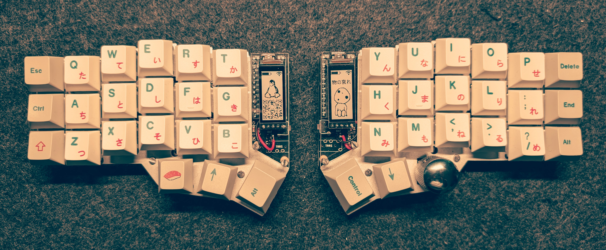
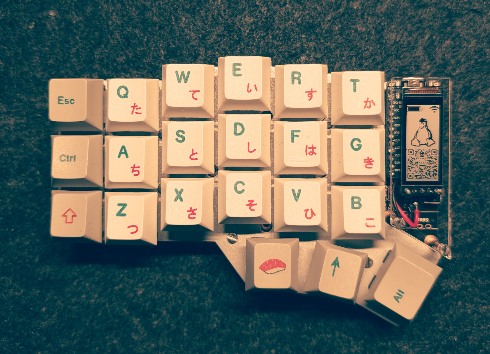
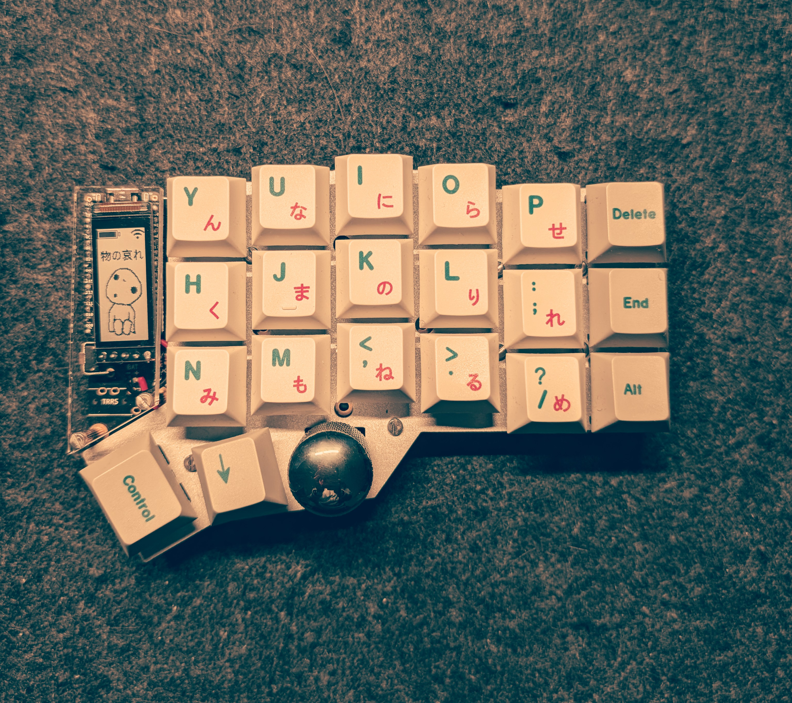
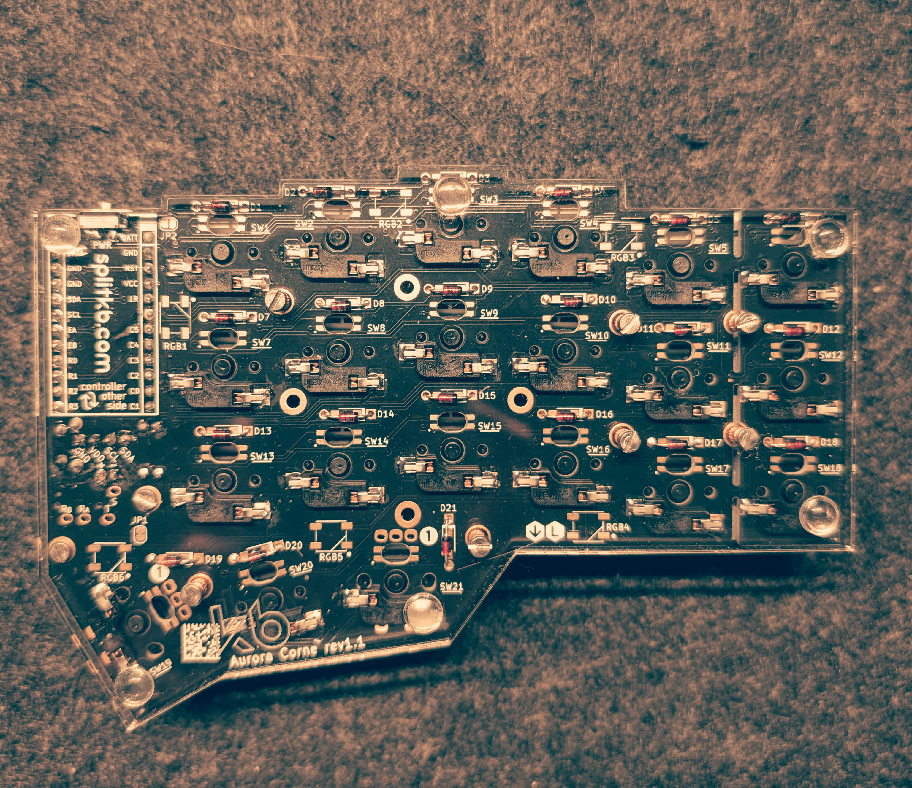

# Aurora Corne Configuration
> This was my first dive into the DIY maker world! It was a fun learning experience. The result is a fully wireless custom keyboard. Below are all parts listed which were used in this build.

## Parts

| Part | Price |
| :--- | :---: |
| [Keycaps](https://www.amazon.de/-/en/Japanese-Sublimation-Switches-Mechanical-Keyboards/dp/B09B3KCT7C?crid=TN2J02A068C3&dib=eyJ2IjoiMSJ9.oTYgfI49MH86Fhi3EQ3DcV6-ZIWrAgoZfMCcSUdt9LjbsdIUG2lOsqxsMhTFD17BrCtyLr-fi8a0yB6xP6en_wlTdwwh3NDbcgtJk44itE3x6iCkmG3RmV4J0PvPv22Dn5eSBQIX8ZFsfZ9bYWEDABgvs6YwP0l2JiIP2wvAoQHIoWRr1j9y3b8MrFyFW7oFJSVOff1kPnkXNu0EqFFYV8NFAQ5HaQnWAHUrh1nxMdo.cfcDAU8H3kZUST2C7FswD8FmU_u2WCjyA2Bh2E6sjDc&dib_tag=se&keywords=sushi%2Bkeycaps&qid=1768250414&sprefix=sushi%2Bkey%2Caps%2C120&sr=8-1&th=1) | 34.99 € |
| [Printed Circuit Boards](https://splitkb.com/collections/keyboard-kits/products/aurora-corne) | 34.94 € |
| [Battery](https://ampul.eu/en/battery/5763-li-pol-battery-110mah-37v-301230-ph2-2pin) (2 units) | 11.56 € |
| [Controller](https://splitkb.com/collections/keyboard-parts/products/nice-nano) (2 units) | 51.88 € |
| [Display](https://splitkb.com/collections/keyboard-parts/products/nice-view) (2 units) | 43.90 € |
| [Mill Max Sockets](https://splitkb.com/collections/keyboard-parts/products/mill-max-low-profile-sockets?variant=47060695646555) (2 units) | 22.90 € |
| [Display Hotswap Sockets](https://splitkb.com/collections/keyboard-parts/products/low-profile-socket-strip-4-positions) | 3.75 € |
| [Encoder Knob](https://splitkb.com/collections/keyboard-parts/products/knurled-metal-encoder-knob) | 6.49 € |
| [Rotary Encoder](https://splitkb.com/collections/keyboard-parts/products/industrial-rotary-encoder) | 5.45 € |
| [Switches](https://en.akkogear.com/product/akko-v3-pro-penguin-switch-silent) | 16.95 € |
| [Case Hardware Kit](https://splitkb.com/collections/keyboard-parts/products/aurora-low-profile-case-hardware-kit) | 8.45 € |
| [Top Plates](https://splitkb.com/collections/cases-and-plates/products/aurora-corne-low-profile-case) | 22.95 € |
| [Bottom Plates](https://splitkb.com/collections/cases-and-plates/products/aurora-corne-low-profile-case?variant=43446808838403) | 8.95 € |
| [Oled Cover](https://splitkb.com/collections/cases-and-plates/products/aurora-corne-low-profile-case?variant=43468300189955) | 3.94 € |
| **Total** | **277.10 €** |

## Custom Images

- Custom Image  Resolution: 140px * 68px (it is also important to rotate the images 90 degrees, so that 140px is the width and 68px the height)
- This [post](https://www.reddit.com/r/ErgoMechKeyboards/comments/15t3o6k/custom_art_on_niceview_displays/) was really helpful figuring out how to add custom images.